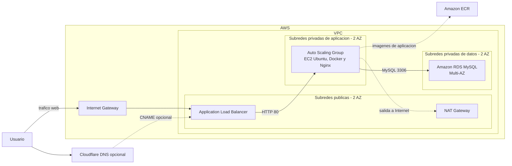

# AWS Deployment

Infraestructura AWS declarativa y operativa para una aplicacion web altamente disponible. El proyecto usa Terraform para crear la plataforma, `cloud-init` en YAML para configurar las instancias y GitHub Actions para validar y desplegar produccion.

## Objetivo

- Mantener una plataforma AWS reproducible para `testing` y `production`.
- Ejecutar la aplicacion en instancias privadas administradas por Auto Scaling.
- Exponer el servicio mediante un Application Load Balancer (ALB).
- Persistir los datos en Amazon RDS MySQL sin exposicion publica.
- Publicar y escanear imagenes de aplicacion en Amazon ECR.
- Opcionalmente administrar un CNAME de Cloudflare hacia el ALB.
- Automatizar la configuracion de Ubuntu exclusivamente con ficheros YAML de `cloud-init`.

## Estado actual

Actualizado: 24 de septiembre de 2026.

| Componente | Estado | Implementacion actual |
| --- | --- | --- |
| IaC | Operativo | Modulo Terraform reutilizable con AWS, Cloudflare y cloud-init. |
| Ambientes | Operativo | Entradas separadas para `testing` y `production`, con ejemplos `.tfvars`. |
| Red | Operativo | VPC, dos subredes por capa, Internet Gateway, NAT Gateway y rutas publicas y privadas. |
| Aplicacion | Operativo | ALB, Launch Template y Auto Scaling Group en subredes privadas. |
| Datos | Operativo | RDS MySQL con subredes privadas, cifrado y acceso solo desde la capa de aplicacion. |
| Imagenes | Operativo | Repositorio ECR con etiquetas inmutables y escaneo al publicar. |
| Cloudflare | Operativo | Registro CNAME condicional administrado por Terraform. |
| Provisionamiento | Operativo | `cloud-init.yml` instala Docker y Nginx, y prepara el usuario `admin`. |
| CI/CD de produccion | Implementado | Validacion en pull requests y plan/apply en `master` con OIDC y entorno protegido. |
| Estado remoto | Configurado | Produccion declara backend S3 y el workflow recibe su configuracion mediante secretos. |

## Resultado final

La infraestructura se encuentra desplegada y funcional. El estado Terraform del ambiente `testing` confirma la creacion de la VPC, seis subredes en dos zonas de disponibilidad, Internet Gateway, NAT Gateway, ALB, Target Group, Launch Template, Auto Scaling Group, RDS MySQL, ECR, grupos de seguridad y el registro Cloudflare.

Las instancias de aplicacion no reciben trafico directo desde Internet: el ALB distribuye las solicitudes hacia el Auto Scaling Group y la base de datos solo acepta conexiones MySQL desde la capa de aplicacion.

## Arquitectura cloud

Cada ambiente define una VPC distribuida en dos zonas de disponibilidad: una capa publica para el ALB y el NAT Gateway, una capa privada para la aplicacion y una capa privada para datos.



Los grupos de seguridad aplican una separacion por capas: el ALB recibe trafico definido por ambiente, las instancias solo aceptan trafico de aplicacion desde el ALB y RDS solo admite MySQL desde las instancias de aplicacion.

## Recursos desplegados

- VPC con DNS habilitado.
- Dos subredes publicas, dos privadas de aplicacion y dos privadas de datos.
- Internet Gateway, Elastic IP, NAT Gateway y tablas de rutas por capa.
- Application Load Balancer, Target Group y listener HTTPS.
- Launch Template y Auto Scaling Group con capacidad configurable.
- Repositorio Amazon ECR con escaneo al publicar e imagenes inmutables.
- Instancia Amazon RDS MySQL en subredes privadas, con cifrado y Multi-AZ configurables.
- Regla CNAME en Cloudflare, creada solo cuando `cloudflare.enabled = true`.

## Ambientes y estructura

```text
.
|-- .github/workflows/deploy-env-production.yml  # Validacion y despliegue productivo
|-- infraestructure/
|   |-- environments/
|   |   |-- production/                          # Entrada Terraform y backend S3
|   |   `-- testing/                             # Entrada Terraform para pruebas
|   |-- modules/                                 # Recursos AWS, Cloudflare y cloud-init
|   |   `-- scripts/cloud-init.yml               # Bootstrap declarativo de Ubuntu
|   `-- terraform.sh                             # Comando local para Terraform
|-- .env.example                                 # Variables locales de Cloudflare
`-- README.md
```

| Ambiente | Directorio | Configuracion de ejemplo | Backend |
| --- | --- | --- | --- |
| Testing | `infraestructure/environments/testing` | `test.tfvars.example` | Local |
| Production | `infraestructure/environments/production` | `prod.tfvars.example` | S3 |

## Provisionamiento con cloud-init

El proyecto no usa Bash scripting para aprovisionar instancias. El archivo [cloud-init.yml](</C:/Users/Usuario/APISYS/PROYECTOS%20DE%20INFRAESTRUCTURA/aws-deployment/infraestructure/modules/scripts/cloud-init.yml>) se incorpora al Launch Template como `user_data` y realiza lo siguiente:

- Actualiza los paquetes del sistema.
- Instala `ca-certificates`, `curl`, Docker y Nginx.
- Crea el usuario administrativo `admin` con privilegios `sudo`.
- Habilita Docker y Nginx al inicio de la instancia.

`infraestructure/terraform.sh` es una utilidad local para ejecutar comandos Terraform; no forma parte del aprovisionamiento de las EC2.

## Uso local

Requisitos: Terraform 1.5 o superior, credenciales AWS configuradas localmente, una Key Pair existente en AWS, una contraseña segura de RDS y, si se activa Cloudflare, un `CLOUDFLARE_API_TOKEN` en `.env`.

1. Copie el archivo de ejemplo del ambiente a un archivo `.tfvars` no versionado y sustituya los placeholders.
2. Para pruebas, ejecute:

```bash
cd infraestructure/environments/testing
terraform init
terraform plan -var-file="test.tfvars"
terraform apply -var-file="test.tfvars"
```

3. Para produccion, inicialice el backend S3 con sus valores reales antes de planificar:

```bash
cd infraestructure/environments/production
terraform init \
  -backend-config="bucket=<bucket-de-estado>" \
  -backend-config="key=production/terraform.tfstate" \
  -backend-config="region=us-east-1" \
  -backend-config="dynamodb_table=<tabla-de-bloqueo>" \
  -backend-config="encrypt=true"
terraform plan -var-file="prod.tfvars"
```

Tambien puede usar `infraestructure/terraform.sh <testing|production> <init|validate|plan|apply|destroy> [archivo.tfvars]`. Revise siempre `terraform plan` antes de ejecutar un `apply` o `destroy`.

## CI/CD de produccion

El workflow [deploy-env-production.yml](</C:/Users/Usuario/APISYS/PROYECTOS%20DE%20INFRAESTRUCTURA/aws-deployment/.github/workflows/deploy-env-production.yml>) se activa para cambios de infraestructura:

- En pull requests, ejecuta `terraform fmt -check`, `terraform init -backend=false` y `terraform validate` sobre produccion.
- En un `push` a `master`, crea un plan y aplica exactamente ese plan en el entorno protegido `production`.
- Usa OIDC para asumir un rol temporal de AWS; no requiere claves AWS de larga duracion en GitHub.
- Impide el `apply` hasta que la variable del entorno `PRODUCTION_STATE_READY` sea `true`.

Configure estos secretos en el entorno GitHub `production`:

- `AWS_DEPLOY_ROLE_ARN`
- `PRODUCTION_TFVARS`
- `TF_STATE_BUCKET`
- `TF_STATE_LOCK_TABLE`

Configure revisores requeridos para el entorno `production` y migre primero el estado local al backend S3. El workflow no realiza esa migracion automaticamente.

## Operacion continua

- Use `terraform plan` antes de cada cambio y aplique solo planes revisados.
- Mantenga `rds_password`, credenciales de Cloudflare y configuracion del backend fuera del control de versiones.
- Realice los despliegues de produccion desde el workflow protegido para conservar la aprobacion y la autenticacion OIDC.
- Mantenga actualizados los ficheros YAML de `cloud-init` para que las nuevas instancias del Auto Scaling Group conserven la configuracion esperada.
