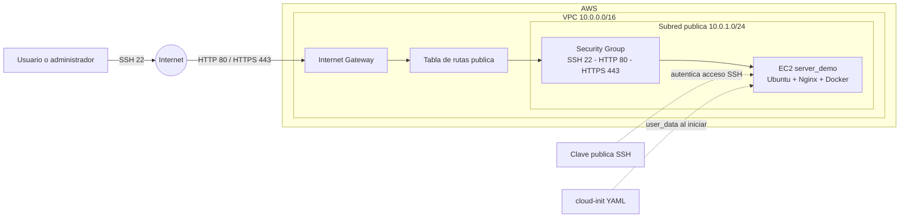

# AWS Deployment

Proyecto de automatizacion para aprovisionar una instancia web en AWS. La base actual utiliza Terraform para definir infraestructura y `cloud-init` con ficheros YAML para configurar la instancia EC2. El objetivo es completar este flujo con pipelines CI/CD.

## Objetivo del proyecto

Construir un proceso reproducible de despliegue que permita:

- Aprovisionar infraestructura AWS con Infraestructura como Codigo (IaC).
- Mantener configuraciones separadas para `testing` y `production`.
- Configurar una instancia Ubuntu de forma automatica.
- Validar y desplegar los cambios desde GitHub Actions.
- Centralizar el bootstrap del servidor en ficheros YAML de `cloud-init`.

## Estado actual

Actualizado: 1 de septiembre de 2026.

| Componente | Estado | Implementacion actual |
| --- | --- | --- |
| IaC | Implementado | Terraform modular para red, seguridad, clave SSH e instancia EC2. |
| Ambientes | Implementado parcialmente | Existen composiciones para `testing` y `production`. |
| Bootstrap | Implementado | `cloud-init` instala paquetes, crea un usuario administrador y habilita Nginx. |
| Provisionamiento | Implementado | La configuracion del servidor se define con `cloud-init` en ficheros YAML. |
| CI/CD | Pendiente | Los workflows existen, pero aun no validan ni despliegan infraestructura. |
| Estado remoto y secretos | Pendiente | El backend remoto y la gestion segura de secretos no estan configurados. |

## Infraestructura implementada

El modulo ubicado en `infraestructure/modules/` crea los siguientes recursos en AWS:

- VPC con soporte DNS habilitado.
- Subred publica, Internet Gateway y tabla de rutas publica.
- Security Group con entrada para SSH (22), HTTP (80) y HTTPS (443).
- Key Pair de EC2 a partir de `server_demo.key.pub`.
- Instancia EC2 con IP publica.
- Outputs de IP publica, tipo de instancia y CIDR de la VPC.

La configuracion inicial de la EC2 se entrega mediante `user_data_base64` y el archivo [cloud-init.yaml](</C:/Users/Usuario/APISYS/PROYECTOS DE INFRAESTRUCTURA/aws-deployment/infraestructure/modules/scripts/cloud-init.yaml>). En una imagen Ubuntu, este instala herramientas base, Docker, Git y Nginx; crea el usuario `admin`; y habilita y reinicia el servicio Nginx.

## Arquitectura cloud

La siguiente maqueta representa la arquitectura creada por el modulo Terraform para cada ambiente. El trafico web entra desde Internet hacia la instancia EC2 ubicada en una subred publica; `cloud-init` completa la configuracion de Ubuntu al iniciar la instancia.



El Security Group permite actualmente SSH, HTTP y HTTPS desde Internet. Esta apertura debe restringirse antes de utilizar el entorno como produccion.

## Ambientes

| Ambiente | Punto de entrada | Variables de ejemplo |
| --- | --- | --- |
| Testing | `infraestructure/environments/testing/main.tf` | `test.tefvars.example` |
| Production | `infraestructure/environments/production/main.tf` | `prod.tfvars.example` |

Cada ambiente invoca el modulo comun y define su configuracion de instancia mediante un objeto que contiene AMI, tipo y parametros de volumen. Los ejemplos de variables son plantillas: deben copiarse a un archivo `.tfvars` ignorado por Git y adaptarse al ambiente.

## Estructura

```text
.
|-- .github/workflows/                 # Definiciones iniciales de GitHub Actions
|-- infraestructure/
|   |-- environments/
|   |   |-- production/                 # Composicion Terraform de produccion
|   |   `-- testing/                    # Composicion Terraform de pruebas
|   `-- modules/                        # Recursos AWS reutilizables y cloud-init
|       `-- scripts/cloud-init.yaml     # Bootstrap de Ubuntu
|-- server_demo.key.pub                 # Clave publica para EC2 (local, no versionada)
`-- README.md
```

## Uso de Terraform

Prerequisitos: Terraform instalado, una cuenta AWS con permisos para crear los recursos descritos y credenciales disponibles mediante `AWS_ACCESS_KEY_ID` y `AWS_SECRET_ACCESS_KEY`. La clave publica `server_demo.key.pub` debe estar disponible en la raiz del proyecto.

Ejemplo para `testing`:

```bash
cd infraestructure/environments/testing
terraform init
terraform plan -var-file="test.tfvars"
terraform apply -var-file="test.tfvars"
```

Ejemplo para `production`:

```bash
cd infraestructure/environments/production
terraform init
terraform plan -var-file="prod.tfvars"
terraform apply -var-file="prod.tfvars"
```

Revise siempre el resultado de `terraform plan` antes de aplicar cambios. La eliminacion de recursos debe ejecutarse de forma explicita y solo cuando corresponda:

```bash
terraform destroy -var-file="test.tfvars"
```

## CI/CD: objetivo

El directorio `.github/workflows/` contiene los puntos de partida para los pipelines:

- `CI.yml` se ejecuta en `push` y `pull_request` sobre `master`, pero actualmente solo imprime mensajes de ejemplo.
- `infraestructure.yml` esta vacio.
- `deploy-production.yml` es un placeholder.

La implementacion esperada es un pipeline que ejecute `terraform fmt -check`, `terraform validate` y `terraform plan` en cambios de infraestructura; que requiera aprobacion antes de `terraform apply` en produccion; y que tome las credenciales desde GitHub Secrets u OIDC, nunca desde archivos `.tfvars` versionados.

## Provisionamiento con cloud-init

El proyecto no utilizara Bash scripting para el aprovisionamiento. Toda la configuracion de las instancias se mantendra en ficheros YAML de `cloud-init` dentro de `infraestructure/modules/scripts/`. Esta estrategia concentra la definicion del sistema operativo, paquetes, usuarios y servicios en artefactos declarativos y versionados junto con la infraestructura.

## Consideraciones antes de produccion

- El estado de Terraform se mantiene localmente; falta configurar un backend remoto con bloqueo de estado.
- Las reglas de SSH permiten acceso desde `0.0.0.0/0`; deben restringirse a redes o rangos autorizados.
- Los entornos comparten varios valores de red y seguridad; falta parametrizarlos y diferenciarlos de forma efectiva por ambiente.
- La configuracion de volumen se declara en las variables, pero el recurso EC2 aun no la aplica.
- Antes de automatizar despliegues, deben corregirse y validarse las rutas de la clave publica y toda la configuracion con `terraform validate` y `terraform plan`.

## Proximos pasos

1. Corregir y validar la configuracion Terraform de ambos ambientes.
2. Configurar backend remoto y autenticacion AWS segura.
3. Ampliar y validar los ficheros YAML de `cloud-init` segun las necesidades de cada ambiente.
4. Implementar validacion de Terraform y de los YAML en pull requests.
5. Crear un despliegue productivo con aprobacion y control de cambios.
